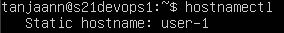
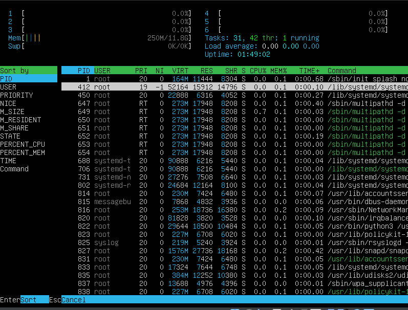
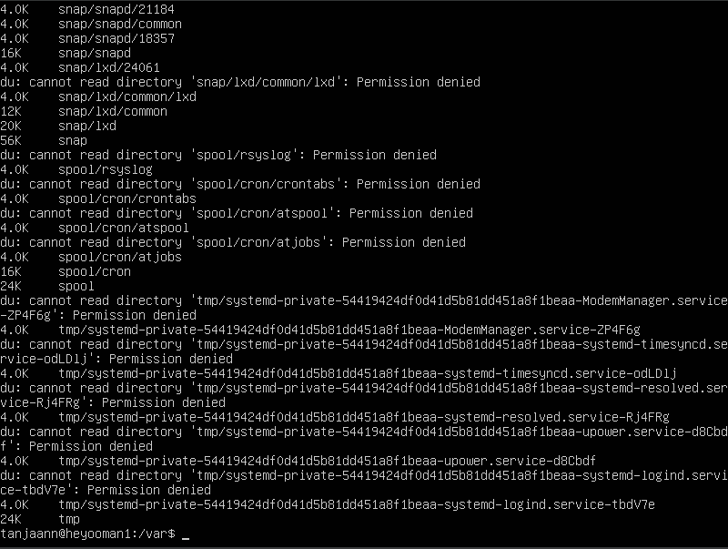

## Part 1. Установка ОС
- ### Устанавливаю Ubuntu 20.04 Server LTS
    
    - **Первый запуск VM, саамое начальное начало** \
    
    
    - **В процессе установки** \
    
    
    - **Прожимаю команду cat** \
     

---

## Part 2. Создание пользователя
- ### Создаю юзера 
    
    - Используя команду **useradd** \
    
        - Сначала создал юзера **moshimoshi** но не успел сделать скриншот, поэтому создал ещё одного юзера **bruddah** 
        - Кстати, после прожатия команды **clear** текст стал чёрно-белым 
    --- 
    - Вывод команды cat /etc/passwd \
    
        - Добавил к выводу операнд палки и **grep** чтобы сократить вывод. (а то там список длинный)
    ---
    - Добавление юзера в группу adm \
    
        - Флаг **-a** добавляет юзера в группу, не удаляя его из других групп
        - Флаг **-G** указывает куда добавить юзера

---

## Part 3. Настройка сети ОС

- ### Задаю название машины *user-1*

    - Через команду **hostnamectl** \
    
        - Также можно сделать это через редактирование файлов
            - **etc/hostname**
            - **etc/hosts**
    ---
    - Проверяем наш **hostname** \
    
        - Также можно использовать команду **hostname** 
---

- ### Устанавливаю временную зону соответствующую нашей
    
    - Используя команду **timedatectl** \
    
        - Перед этим можно узнать список всех доступных тайм зон через команду:
        - **timedatectl list-timezones** 
    ---    
    - Проверяю установился ли часовой пояс \
    
       - Также можно использовать команду **date**
---

- ### Вывожу названия сетевых интерфейсов
    - Используя команду **ifconfig**

    

    
    - Интерфейс **lo** (loopback)
        - Является стандартным и обязательным элементом систем в которых используется TCP/IP
        - Используется для тестирования сетевых соединений, и обеспечения локального взаимодействия на одной машине.
        - **lo** всегда имеет IP-адрес 127.0.0.1 - localhost.
        - Позволяет безопасно тестировать сетевые сервисы, без надобности открывать порт для внешнего входа.
---

- ### Получаю IP адрес устройства от DHCP сервера
    - Используя команду **ip addr show** \
    
        - IP адрес получается указан в **enp0s3** - **inet**
    - Что такое **DHCP**? Это Dynamic Host Configuration Protocol, используется для автоматического назначения IP-адресов устройствам в сети.
        - Позволяет устройствам автоматом получать
            - IP-адрес
            - Маску подсети
            - Адрес шлюза (gat)
            - Адреса DNS-серверов
        - Работает на основе модели **клиент-сервер**
        - Процесс получения адреса состоит из четырёх этапов **DORA** (Discovery, Offer, Request, Acknowledgement)
        - Потенциальные минусы DHCP могут быть в увеличении трафика (что снижает производительность), также DHCP может быть менее безопасным в сравнении со статической IP-адресацией.
---

- ### Определяю внешний IP-адерс и внутренний IP-адрес 
    - Используя команду **ip route** \
    
        - **default** это внутренний (gateway) адрес
        - **enp0s3** это внешний (IP) адрес
            - **en** означает Ethernet
            - **p0** указывает на номер шины PCI
            - **s3** указывает на номер слота на шине PCI
            - Это имя интерфейса остаётся стабильным независимо от ребутов и изменений конфигов машины, что упрощает настройку сети.
---

- ### Вручную задаю настройки ip, gw, dns. Через netplan

    - Через команду **ip a** узнаём наш дефолтный IP адрес \
    
    - Затем удаляем файл дефолтного конфига командой (или делаем бэкап)
        - **sudo -rm -rf /etc/netplan/00-installer-config.yaml**
    - Создаём и редактируем файл нашего статик конфига (название любое может быть ок-ца) 
        - **sudo vim /etc/netplan/00-static.yaml** \
    
        - ставлю адрес **10.0.2.69**
        - использую DNS сервер **8.8.8.8** (гугловский)
    - Применяем наш новый конфиг командой
        - **sudo netplan apply** 
    - Выводим наши новые настройки командой **ip a** \
    
        - наш IP адрес изменился на **10.0.2.69**
    - Ребутаюсь командой **sudo reboot now**
        - ну или просто **reboot**
    - Настройки остались: \
    
    - Пингую ya.ru командой **ping ya.ru** \
    

- ###### https://www.youtube.com/watch?v=fayx4jWqyWk
-  ###### https://linuxconfig.org/how-to-configure-static-ip-address-on-ubuntu-18-04-bionic-beaver-linux
-  ###### https://linuxconfig.org/how-to-configure-static-ip-address-on-ubuntu-18-04-bionic-beaver-linux
-  ###### https://tecadmin.net/setup-static-ip-address-on-ubuntu-using-netplan/

---

## Part 4. Обновление ОС

**Обновляю системные пакеты до последней версии**
- Используя команду
    - **sudo apt update**
        - для обновления списка обновлений
    - **sudo apt upgrade**
        - для установки обновлений, нужно будет прожать **Y** для подтверждения
- В процессе апгрейда 
    
    

- После апгрейда, когда всё уже установлено
    
    

---

## Part 5. Использование команды **sudo**

**Разрешаю юзеру созданному в Part 2 выполнять команду sudo** 

- Через команду
    - **sudo usermod -aG sudo %имя_юзера%**
        - где флаги **-aG** значат **append, group** тоесть добавить к группе **sudo**    

- Что такое **sudo**? 
    - Это волшебное слово!!!!1!!1! Которое предоставляет пользователю права **super user**, (root права, права администратора.)
    - Позволяет юзерам становится **root** юзером без надобности заходить под учёткой **root**
    - Чтобы иметь возможность юзать **sudo**, пользователь должен иметь запись в файле **/etc/sudoers**
    - Ну и важно понимать что ты делаешь когда прожимаешь команды с **sudo** правами, иначе можно систему положить или других дел наворотить

---

**Меняю hostname ОС через sudo**
- Сначала меняю учётку на другого пользователя через команду **su** (switch user)
    - **su bruddah**
- Затем меняю hostname используя команду
    - **sudo hostnamectl set-hostname %новое_имя%** \
    

---

## Part 6. Установка и настройка службы времени

- Прожимаю команду 
    - **timedatectl show** \
 
    - И вижу часовой пояс, и **NTPSynchronized=yes**

- Для вывода тайм-зоны также можно прожать 
    - **timedatectl | grep "Time zone** \

---

## Part 7. Установка и использование текстовых редакторов

- Текстовый редактор **VIM** и **NANO** уже предустановлены системой, установил тектовый редактор **MCEDIT** через команду:
    - **sudo apt install mcedit**

### Первая часть где вписываем свой ник и сохранемся
---

**VIM**
- Прожимаю **vim test_vim.txt**
- Вхожу в режим **INSERT** нажимая клавишу **I**, пишу никнейм
- Нажимаю **ESC** чтобы вернутся в стандартный режим
- Ввожу **":wq"**, тоесть ввожу **двоеточие**, и **w** - для write, сохранения; и **q** - quit, для выхода. \

---

**NANO**
- Прожимаю **nano test_nano.txt**
- Ввожу никнейм, сразу без всяких режимов
- Прожимаю **CTRL+S** для сохранения (ну или **CTRL-O**) 
- И **CTRL-X** для выхода \

---

**MCEDIT**
- Запускаю это всё через **mcedit test_mcedit.txt**
- Прописываю свой ник
- Через виртуальную клавиатуру прожимаю **F2** чтобы сохраниться, и затем **F10** чтобы выйти \

---
---

### Вторая часть где вписываем "21 School 21" и не сохраняемся

**VIM**
- Открываю файл и вписываю **21 School 21**
- Ввожу **":q!"**, тоесть ввожу **двоеточие**, и **q** - quit, для выхода, и **!** чтобы не сохранять изменения и проигнорировать предупреждение о несохранении \

---

**NANO**
- Открываю файл и вписываю **21 School 21**
- Прожимаю **CTRL-X** для выхода, подтверждаю выход без изменений нажатием **N** (тоесть он спрашивает "Save modified buffer?" и я говорю "No") \

---

**MCEDIT**
- Открываю файл и вписываю **21 School 21**
- Через виртуальную клавиатуру прожимаю **F10** чтобы выйти
- В появившемся окне опять же говорю **No** когда спрашивает сохранять ли \

---

### Третья часть где ищем слова в файле

**VIM**
- Ищу слово через **/**
    - в данном примере ищу слово **love**
    - внизу в статус баре стоит **/love** \
    

---

**NANO**

- Ищу слово **BRUH** через шорткат **CTRL+W**
    - Курсор переходит на нужное слово
    - В данном примере он под буквой **B** \
    

---

**MCEDIT**

- Ищу слово **jojo** через нажатие **F7** на виртуальной клавиатуре \
    

---

### Третья часть, где ищем и заменяем слова

**VIM**
   
- Открываю файл через vim, захожу в командный режим (режим двоеточия), и ввожу:
    - **:%s/HAPPY/depressed/g**
        - **:[дальность]s/{что ищем}/{на что заменяем}/[флаги]** - общий синтаксис
        - **:s** - это сокращение от substitute (заменить)
        - тоесть в нашем примере:
            - дальность **%** - во всём файле
            - ищем слово **HAPPY**
            - заменяем его на **depressed**
            - и флаг **g** чтоб прошёлся по каждой строке 

---

## Part 8. Установка и настройка SSHD

- ### Устанавливаю службу SSHD
    - Используя команду :
        - **sudo apt install openssh-server**
---
- ### Добавляю автостарт службы при загрузке системы
    - Используя команду :
        - **sudo systemctl enable ssh.socket**
        - или же **sudo update-rc.d ssh defaults** \
        

---

- ### Перенастраиваю SSHd на порт 2022

    - Для этого нам надо открыть файл конфига sshd
        - **sudo vim /etc/ssh/sshd_config**
    - Раскомментить линию **#Port 22** и заменить её на **Port 2022** \
        
    - Затем надо перезапустить SSHD сервис, используя :
        - **sudo systemctl reload sshd**
    - И открыть этот порт в фаерволле :
        - **sudo ufw allow 2022** \
        
    - Можно проверить что всё подключается через :
        - **ssh %IP_ADRESS% -p 2022** 
        - Ну и при закрытии ssh соединения через команду **exit** будет вывод что произошёл logout \
        

---

- ### Юзаю команду ps, вижу наличие процесса sshd
    - Используя команду :
        - **ps -e**
            - Где флаг **-e** это флаг показа всех процессов (без него список процессов будет из 2-3 позиций)
            - Можно ещё добавить флаг **-f** для детального показа информации
        - Также добавил операнд палки и grep, чтоб список не был огроменющий \
        

---

- ### Ребутаюсь и вывожу netstat
    - Прожимаю команды :
        - **sudo systemctl restart sshd**
        - **netstat -tan** \
        
    - Что за флаги **-tan**?
        - **-t**, tcp. Показывает активные TCP соединения.
        - **-a**, all. Показывает и слушающие порты и все активные.
        - **-n**, numeric. Показывает адреса числами а не доменными именами
            - Например заместо **google.com** покажет **172.217.18.110**

    - Что за столбцы выводит **netstat -tan**?
        - **Proto** протокол соединения, TCP/TCP6 или UDP.
            - TCP юзается для надёжного соединения, юзает 32-битные адреса
            - TCP6 часть IPv6, который юзает 128-битные адреса
            - UDP для быстрого соединения, с возможными потерями

        - **Recv-Q** recover queue. Показывает количество данных стоящих в очереди на получение от процесса.
            - Если значение не ноль, то скорее всего бандвича не хватает

        - **Send-Q** send queue. Очередь на отправку от процесса.
            - Если не ноль, то наверное процесс/приложение генерирует данные быстрее чем они могут быть отправлены.

        - **Local Address** показывает IP-адрес и порт устройства на котором прожали netstat 

        - **Foreign Address** показывает IP-адрес и порт устройства куда идёт соединение. Может быть как ПК в локальной сети, или ПК из интернетов.
            - Если у процесса в этом столбце указан **localhost** то процесс "общается" сам с собой, скорее всего тестирует фичу.

        - **State** состояние. Бывает три типа состояний в этом столбце:
            - **LISTEN**, ожидает соединения.
            - **ESTABLISHED**, соединение активно.
            - **CLOSE_WAIT**, соединение закрыто с другой стороны (не на этом устройстве)

    - Что за значение **0.0.0.0**?
        - Адрес плейсхолдер, который означает что процесс может принять соединение из любого адреса и порта. 
        - В сути своей так работают интернет сайты, и любые общедоступные сервисы/приложения.
        - Его иногда обзывают **default route** или **unspecified address**
---

## Part 9. Установка и использование top, htop
    
- ### Вывод утилиты top: 

    

    - **Uptime:**
        - в первой строке **up 1:06** на скриншоте

    - **Кол-во авториз юзеров:**
        - **1 user** авторизован

    - **Общая загрузка системы:**
        - **load average** 0.00. почему там 3 значения? потомучт это три временных отрезка
            - за последнюю 1 минуту, последние 5 минут, и 15 минут.

    - **Общее количество процессов:**
        - **Tasks: 140 total**
            - **running** это запущенные процессы
            - **sleeping** процессы ждущие какого-то события, ждут либо сигнал, или когда RAM память освободится, или пока CPU дойдет до них в очереди.
            - **stopped** это остановленные пр-цсы, они не используют ресурсов но сидят в списке процессов
            - **zombie** это процесс который завершил исполнение но его ещё не вычистили из таблицы. Ресурсов не ест.

    - **Загрузка CPU:**
        - **%CPU(s): 0.0**
            - **us** - user процессы
            - **sy** - system процессы
            - **id** - idle процессы

    - **Загрузка RAM:**
        - **248.4 used** на скриншоте

    - **PID с наибольшим RAM использованием:**
        - нажимаю **Shift+M**, top сортирует всё по memory usage
        - вижу что больше всего памяти жрёт pid **1337**, процесс **fwupd** \
        

    - **PID с наибольшим CPU временем:**
        - Прожимаю **Shift+P**, сортировка по CPU usage
        - Вижу что больше всего ЦПУ жрёт **tanjaann**!, процессом **top**, номер **pid** 1425 \
        

---

- ### Вывод утилиты htop:

    - Кароч прожимаем **F6** и видим меню сортировки: \
    

    - **Отсортированный по PID, PRCNT_CPU, PRCNT_MEM, TIME:** \
        - **PID:** \
        

        - **PRCNT_CPU:** \
        

        - **PRCNT_MEM:** \
        

        - **TIME:** \
        
    

        - **Отфильтрованный для процесса SSHD:**
            - Через прожатие **F4** вводим **sshd** и оно его находит

        
        
        - **С процессом SYSLOG, найденным через поиск:**
            - Также через прожатие **F4** 

        

        - **С добавленным выводом hostname, clock, uptime:** 

        

---

- ## Part 10. Использование утилиты fdisk

- ### Запускаю fdisk

    - Командой **fdisk -l** \
        

        - Название жёсткого диска:
            - **VBOX HARDDISK** в строке **Disk Model:**
        - Размер диска:
            - sda3 - **8.3 GiB**
        - Количество секторов:
            - **17295360** (bruh, rly? that much?)
        - Размер **swap** файла:
            - **0 bytes** 
            
        

---

- ## Part 11. Использование утилиты df

- ### Запускаю команду df, на корневом разделе: 

    

> Размер раздела: 
    - **8408452** 1K blocks 

> Размер занятого пространства:
    - **2840612** 1K blocks

> Размер свободного пространства:
    - **5119124** 1K blocks

> Процент использования: 
    - **36%**

- Единица измерения в выводе (1K Block) это блоки по 1024 байтов. Важно отметить что 1К эт не 1000, а именно 1024 - почему? Потомучт происходит это всё дело из двоичной системы счисления.

--- 

- ### Запускаю команду df -Th, на корневом разделе:
     \
**T**, Type - это вывод типа файловой системы \
**h**, human-readable - показ не через 1К блоки а через кило-мега-гига- байты.

> Размер раздела:
    - Size **8.1 GB**

> Размер занятого пространства:
    - Used **2.8 GB** 

> Размер свободного пространства:
    - Avail **4.9 GB**

> Процент использования:
    - Use% **36%**
    
- **EXT4** (*fourth extended system*) - это журналируемая файловая система для Linux. Поддерживает большие объёмы хранения, обеспечивает высокую надёжность, и требует минимального обслвуживания. Стала стандартом для Debian и Ubuntu. 
- В чём прикол *журналируемой* файловой системы?
    - В ней ведётся журнал изменений, который помогает сохранить данные в случае сбоев. Защита от вырубания электро, резких выключений и тд.

---

- ## Part 12. Использование утилиты du

    - Прожал **du:** \

    - Размер **/home** - 160 kb \
    

    - Размер **/var** - 870 mb \
    

    - Размер **/var/log** - 206 mb \
    

    - Прожимаю **du * -h** находясь в папке /var \
    

- ## Part 13. Установка и юзание утилиты ncdu

    - ### Устанавливаю ncdu 
        

    - ### Вывожу размеры папок:
        - **home** - 160 kb
        - **var** - 869.4 mb\

            

        - **var\log** - 205 mb \
        

- ## Part 14. Работа с системными журналами

- Ну во первых что это за файлы логов?
    - **dmesg** хранит логи ядра и модулей ядра, из **kernel ring buffer**. В основном это сообщения и инфа о устройствах и их подключении.
    - **syslog** является журналом всех действий в глобальной системе. Является ключевым для сисадминов, так как содержит подробную информацию о событиях и ошибких происхдящих в системе.
    - **auth.log** содержит инфу о авторизации юзеров. Включая успещные и неудачные попытки входа.

- ### Время последней успешной авторизации, имя юзера, и метод входа
    - юзер **tanjaann** | время **02:53:04** \
    
    - через метод **systemd-logind** \
    
        - а что такое **systemd-login?** Это компонент системы который управляет сеансами юзеров в Linux. Отвечает за отслеживание юзеров и их сессий, управление доступом к устройствам, и предоставление доступа к операциям.
        - ну или через метод **pam_unix**? Это модуль аутентификации на основе паролей. 

---

- ### Ребут службы SSHd и поиск этой операции в логах

- Прожимаю команду:
    - **sudo systemctl restart ssh**

- Лог найден в **syslog** \

---

- ## Part 15. Использование планировщика заданий CRON

- Чтобы добавить задание в CRON, надо прожать
    - **crontab -e** 

- И добавить в этот файл задачу с **uptime**: \

    - Что это за звёздочки?
        - Первая это минуты, поэтому там цифра **2**
        - Вторая это часы             (0-23)
        - Третья это дни месяца       (1-31)
        - Четвёртая позиция это месяц (0-12)
        - Пятая эт день недели        (0-7)

- **CRON** запускает **uptime**, смотрю в файле **syslog** \

- Через **crontab -l** смотрим список задач \

---

- ### Удаляю все задания из планировщика

- Ввожу **crontab -e**, убираю теперь уже ненужные строки \
    - Теперь через вывод **crontab -l** список пуст \

<!-- 

---
## Part example
- ### example

- **example header**

    - example action
        - example note
---

-->

